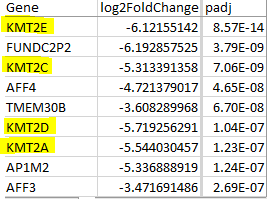
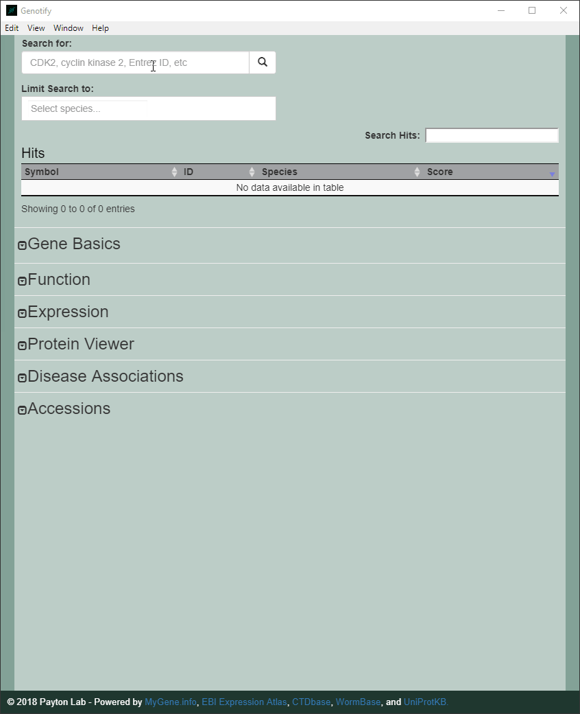
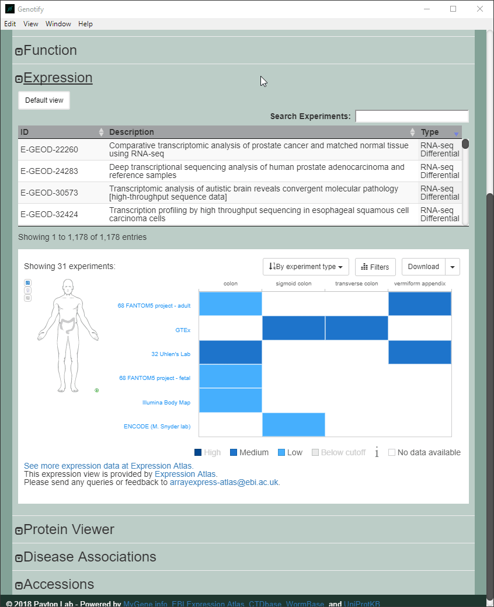

# Genotify

The paper for Genotify is located [here](http://joss.theoj.org/papers/10.21105/joss.00885). Please cite it if you use Genotify in your research:

Andrews et al., (2018). Genotify: Fast, lightweight gene lookup and summarization . Journal of Open Source Software, 3(28), 885, https://doi.org/10.21105/joss.00885

---

Genotify is a light-weight, cross-platform desktop application for quick gene annotations. If you're a molecular biology researcher or bioinformaticist, you likely find yourself Googling gene names relatively frequently, especially when doing a heavy lit review or poring through tables of differentially expressed genes. **Genotify** provides up-to-date gene info and access to multiple interactive widgets without opening a browser. Simply copy a gene name, ID, or symbol to your clipboard and use `ctrl+q` (or `cmd+q`) to query for that gene. Limit by species if you so desire. Click any of the resulting text boxes to copy them to your clipboard.

This program aims to give you access to all of the resources you could ever want for a gene, from links to all of the major databases to functional summaries. Hopefully it does it well.

- [Installation](#installation)
- [Basic Usage](#basic-usage)
- [An Illustrative Example](#an-illustrative-example)
  * [Finding Basic Gene Information](#finding-basic-gene-information)
  * [Finding Disease Associations, Accessions, and Viewing Protein Structure](#finding-disease-associations-accessions-and-viewing-protein-structure)
  * [Investigating Gene Expression](#investigating-gene-expression)
- [Issues & Feedback](#issues-and-feedback)
- [Contributing](#contributing)
- [License](#license)

---

## Installation
Just download the [release](https://github.com/j-andrews7/GenotifyDesktop/releases) for your OS, unpack, and run. To build from source with `node.js`, you can clone the repo and run `npm install` followed by `npm start`.

## Basic Usage
Genotify is dead simple to use. Type a query into the search box and click the search button, hit enter, or use the hotkey `ctrl+q` (or `cmd+q`) to query from clipboard (even if Genotify isn't focused!). Search for and select species with the species filter, or filter hits in the hits table dynamically. Clicking on a different hit in the hits table will show the information for that hit. Expand the various sections to read what said gene does, explore expression data, see disease associations, or view links out to various data sources. Clicking on a text box will copy its contents to your clipboard for easy copying.

Our group frequently uses Genotify to facilitate:

 - rapid, efficient lookup of genes while reviewing literature or curating lists of significant genes,
 - close investigation of families of related genes,
 - quick ascertainment of the biological significance of differentially expressed genes or associating proteins,
 - determination of known disease associations,
 - exploration of protein structure, modifications, and variants,
 - comparison of mRNA expression of a queried gene across diverse tissues, cell types, and species.

## An Illustrative Example
One of the situations where Genotify really shines is when you're digging through a table of results from some analysis. Say you just finished a differential expression analysis from a human cancer cell line treated with a novel compound identified as potentially efficacious and want to determine how the drug might be affecting the biology of these cells. You view the top 10 most downregulated genes after treatment and notice several that seem similar:

### Finding Basic Gene Information
A quick search for our top hit in the list (*KMT2E*) let's us determine it's genomic location, official name, aliases (the KMT2 family are frequently interchanged with their old *MLL* names to this day), and other basic information under the **Gene Basics** section. We could click on another hit in the **Hits** table to view information for the gene in another species. For more info, we can look at the **Function** section and see that the KMT2E protein functions as a histone methyltransferase, trimethylating histone H3 at Lysine 3 (a histone modification often seen near active gene promoters).

Let's try another hit - *KMT2C*, and limit the search to humans only.

### Finding Disease Associations, Accessions, and Viewing Protein Structure

Again, it's a histone methyltransferase (as are KMT2D and KMT2A). We can look at known **Disease Associations**, get **Accessions** to many other databases that will open in your default browser when clicked, and look at the actual structure of the KMT2C protein - domains, variants, post-translation modifications, and more - all with links to their data sources and publications via the ProtVista viewer.

### Investigating Gene Expression
The **Expression** section provides a wealth of information regarding expression of *KMT2C* across many different tissues, experiments, and cell lines through the EBI Expression Atlas. The default view shows many experiments - not super helpful! But we can filter for a specific tissue or cell type easily by clicking the Filter button. We could also download the data with the download button.

We can also search for specific datasets by typing in the Search Experiments box. Maybe we want to know the expression of this gene in a variety of tissues, so we search for the GTEx dataset and can interactively compare the expression. It also has a boxplot view that sometimes makes it easier to compare between samples/tissues. The experiments table will update to show different experiments if a hit for a different species is shown. Sometimes, data won't be found for a given gene in a given experiment. This is usually due to the experiment being a differential expression analysis (Microarray or RNA-Seq Differential), which only contain data for genes that are differentially expressed between the two conditions. The RNA-Seq Baseline experiments are typically more reliable and are what most people will likely find most useful.

Now we know that the drug seems to be affecting histone methyltransferases and can easily determine what diseases these genes are associated with, any known variants that might affect their disease potential, and identify other cell lines that would make good candidates for investigating these genes due to their high expression. It also suggests that maybe some ChIP-seq experiments for histone methylation would be a good idea for next steps. Importantly, **Genotify provides all this information and interactive exploratory widgets in a single place** for convenience and time-saving.

## Issues and Feedback
Hit up the issues pages here and describe the issue in detail. Screenshots may be helpful. I'm usually pretty quick to respond. We are also open to suggestions for new features.

## Contributing
For developing, you will need [`node.js`](https://nodejs.org/en/) installed. Clone the repo and install with `npm install` and run with `npm start`. If you want to contribute, open a pull request that addresses a known issue or adds something of value.

## License
This program is free software: you can redistribute it and/or modify
it under the terms of the GNU General Public License as published by
the Free Software Foundation, either version 3 of the License, or
(at your option) any later version.

This program is distributed in the hope that it will be useful,
but WITHOUT ANY WARRANTY; without even the implied warranty of
MERCHANTABILITY or FITNESS FOR A PARTICULAR PURPOSE.  See the
GNU General Public License for more details.

You should have received a copy of the GNU General Public License
along with this program.  If not, see http://www.gnu.org/licenses/.

Copyright 2018, Payton Lab
